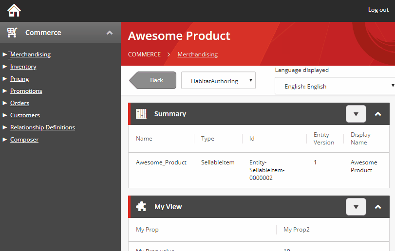

# BizFx Tree Navigation
Sitecore XCのビジネスツールのナビゲーションをツリー形式にするコンポーネントです。  

## スクリーンショット

## 前提条件
- Sitecore Experience Commerce 9.2 Initial Release

## インストール方法
1. SDKを使用してビジネスツールの開発環境をセットアップします（`Sitecore.BizFx.SDK.{version}/README.md`を参照）
1. このリポジトリをクローンします
1. `/src`フォルダを、ビジネスツールの開発環境にコピーします（いくつかのファイルが上書きされます）
1. `ng serve`を実行して、動作を確認します

## ライセンス
このソフトウェアはMITライセンスで公開されています。LICENSE.txtを参照してください。

## 著者
- T.Yamada (xirtardauq@gmail.com)